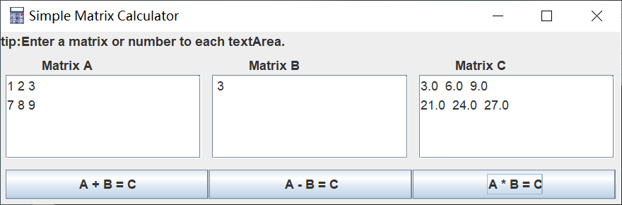

# Simple Matrix Calculator GUI With RMI

## Short Description

A simple calculator which implements **matrix addition** ,**matrix subtraction**,**matrix multiplication** and **scalar multiplication of a matrix**.

Built with swing and concerning API.

The Server and Client are connected with RMI.

## Structure

### Mind Map:

## Use

1. Type `java -jar Server.jar` in any terminal to turn on the service.

2. Type `java -jar Client.jar`  in any terminal to turn one the client.

3. Then you will get it :

   

4. test the functions:

   * addition:
     * 

   * scalar multiplication of a matrix:
     * 

   * matrix multiplication:
     * 

5. Warnings :

   * Can't Find Matrix

     * 

   * Size Dismatch

     * 

   * Invalid Number Format

     * 

     * 